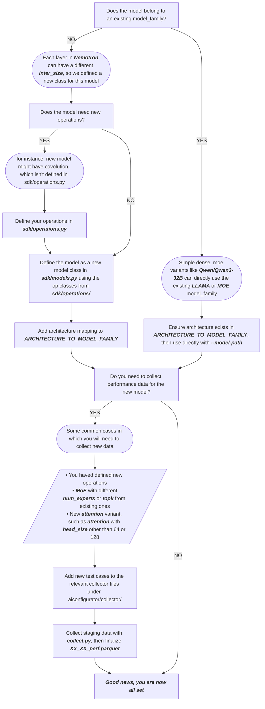

# How to Add a New Model

## Understanding How AIConfigurator Does End-to-End Latency Estimation

How to add a new model depends on how 'new' the model is. First, let's review how aiconfigurator does latency estimation.

In aiconfigurator, the end-to-end latency estimation depends on operation-level latency estimation. There are 3 steps to achieve this:

### 1. Break Down the Model into Operations

The model is broken down into operations, as shown in the source file [`models.py`](../src/aiconfigurator/sdk/models.py). A model is composed of operations such as GEMM and MoE defined in the [`operations` package](../aic-core/src/aiconfigurator_core/sdk/operations/) (see its README for the single-oracle contract).

### 2. Get Operation Latency Estimation

Since #1357 PR-5 (single-oracle), per-op latency/energy/SOL values are
computed only by the compiled Rust engine
(`aic-core/rust/aiconfigurator-core`). The Python `Operation` classes are
typed parameter bags: constructor + fields (the wire parameters),
`get_weights()` (the memory model), and — for table-backed ops — the parquet
loader that feeds enumeration and charts. They contain no interpolation or
lookup math.

Evaluation flows through the engine surfaces in
[`engine.py`](../aic-core/src/aiconfigurator_core/sdk/engine.py): each op
converts to a wire `OpSpec` (`_to_opspec`), and per-op values come back from
`EngineHandle.evaluate_ops_json` / `evaluate_ops_sol_json` (op-list FFI) or
the compiled per-phase/whole-run entry points (`run_static`,
`InferenceSession`). (The legacy per-call surface
(`Operation.query()` / `PerfDatabase.query_*`) was removed after its
one-release deprecation window — there is no per-call Python query API.)

### 3. Collect Data for the Operation

Taking MoE for TensorRT-LLM as an example, the current collector lives in `collector/trtllm/collect_moe.py`, while shared model/op case values live under `collector/cases/`.

#### 3.1 Adding New Test Cases

If the MoE operation you want is not covered by the current inherited
[database](../aic-core/src/aiconfigurator_core/systems/data/h200_sxm/moe/trtllm/1.3.0rc10/moe_perf.parquet),
you need to add the test case in the relevant YAML case file and collect your
own data.

For example, if you want to cover a new model with `num_experts=1024, topk=16`, you should extend the model's `*_cases.yaml` under `collector/cases/models/` or the shared MoE cases under `collector/cases/base_ops/` when the case is common across models.

#### 3.2 Update Database

Finalize the collector's `moe_perf.txt` staging output as
`moe_perf.parquet`, place it in the canonical `moe` family directory, and
rebuild and reinstall aiconfigurator.


## Adding a New Model

Now let's revisit how to add a new model in aiconfigurator. There are 3 situations:

### Situation 1: Simple Variant Without New Operations

If the model is a simple variant of an existing architecture (for example, it's similar to Qwen3 32B and only has slight differences, such as different positional embedding, different q/k/v heads of GQA, different number of layers, different hidden size), these are treated as **simple variants**.

In this case, you just need to ensure the architecture is supported in **ARCHITECTURE_TO_MODEL_FAMILY** in [`common.py`](../src/aiconfigurator/sdk/common.py):

```python
"YourModelForCausalLM": "LLAMA",  # or "MOE", "DEEPSEEK", etc.
```

AIConfigurator will automatically download the model's `config.json` from HuggingFace when you run with `--model-path your-org/Your-New-Model`. The model config is parsed to extract layer count, hidden size, attention heads, etc.

**Note**: If the architecture already exists in `ARCHITECTURE_TO_MODEL_FAMILY` (e.g., `LlamaForCausalLM`, `Qwen3ForCausalLM`, `MixtralForCausalLM`), no changes are needed - just use the model directly.

Here 'LLAMA', 'MOE', 'DEEPSEEK' are the model families defined in **ModelFamily** in [`common.py`](../src/aiconfigurator/sdk/common.py)


### Situation 2: Model Requires Additional Performance Data

This typically refers to a MoE model, as the MoE operation of a new model usually has different `num_experts` and `topk` values, etc. This difference is captured by different data points in aiconfigurator.

You need to follow several steps:

1. Define a new MoE operation test case in the relevant collector YAML case file and follow the collector [README](../collector/README.md) to collect the MoE data points for your model.

2. Finalize the collected staging file as parquet and update the inherited
   database, for example
   `aic-core/src/aiconfigurator_core/systems/data/h200_sxm/moe/trtllm/1.3.0rc10/moe_perf.parquet`.

3. Ensure the architecture mapping exists in **ARCHITECTURE_TO_MODEL_FAMILY** (see **Situation 1**).

Models with different MLA operations also follow a similar process. For example, if it's a variant to model family 'DEEPSEEK' and has different definition of MLA, you need to collect new MLA data points.

### Situation 3: Model Needs New Operation Support

Today, we don't support the Mamba model yet. By looking at the Mamba model, it relies on the support of convolution operations. Convolution is not yet supported, so you need to add a new operation `Conv`.

Steps required (per-op performance math lives ONLY in the compiled Rust
engine — see `.claude/rules/rust-core/parity.md` Rule 2 and
`aic-core/src/aiconfigurator_core/sdk/operations/README.md` for the full
single-oracle flow):

1. **Model `Conv` in the Rust engine**: an operator in
   `aic-core/rust/aiconfigurator-core/src/operators/` (query + SOL roofline +
   energy) and a parquet loader in
   `aic-core/rust/aiconfigurator-core/src/perf_database/`, anchored by a Rust
   `#[cfg(test)]` oracle test.
2. **Define the Python `Conv` op class** in
   `aic-core/src/aiconfigurator_core/sdk/operations/` — constructor, fields,
   `get_weights`, and the parquet loader / `load_data` (the raw data plane for
   charts and the support matrix). No Python `query()` body or interpolation:
   the single-oracle contract test rejects those.
3. **Wire the spec conversion**: a `_to_opspec` branch in
   `aic-core/src/aiconfigurator_core/sdk/engine.py` and an `Op` variant appended
   at the tail of `aic-core/rust/aiconfigurator-core/src/operators/op.rs` (mid-enum
   insertion requires an `ENGINE_SPEC_SCHEMA_VERSION` bump on both sides),
   plus the `aic-core/rust/aiconfigurator-core/src/engine/spec.rs` round-trip fixture.
   `tests/unit/sdk/test_opspec_coverage.py` enforces this.
4. **Define the data collection process** in collector by referring to existing operations' collection code, such as `collect_gemm.py`
5. **Collect data for conv**, register its family in
   `collector/op_backend_catalog.yaml`, and add the finalized parquet file
   under
   `aic-core/src/aiconfigurator_core/systems/data/<system>/<family>/<backend>/<version>/`
   (the engine reads parquet only).
6. **Pin the behavior**: once a shipped model reaches the op, add a parity
   case via `aic-core/rust/aiconfigurator-core/parity_tests/pin_goldens.py`
   (append-only); later modeling
   changes carry their golden diff.
7. **Add new model definition** in `models.py` to build your model with new operation. A new model class is mapping to a new model family.  
update your model in ModelFamily dict defined in [`common.py`](../src/aiconfigurator/sdk/common.py)

### AFD Operation Partitioning Compatibility

Attention-FFN Disaggregated (AFD) estimate mode has one additional maintenance contract beyond the normal aggregated and P/D-disaggregated paths. [`sdk/afd_partition.py`](../src/aiconfigurator/sdk/afd_partition.py) splits a model's `context_ops` / `generation_ops` into A-worker and F-worker pools by operation name. When adding a new model family or new operation, make sure the generated operation names can be classified by the AFD partitioner.

The current AFD partitioning contract is:

1. **A-worker ops**: operations that belong to the embedding / attention side, such as `embedding`, `add_norm_1`, attention norms, `qkv`, MLA, BMM, RoPE, attention kernels, and projection GEMMs.
2. **F-worker ops**: operations that belong to the FFN / MoE side, such as router GEMMs, dense `ffn` / `mlp` ops, routed expert ops, shared expert ops, and activation / gate / up / down GEMMs.
3. **Boundary ops**: operations that naturally sit at the A/F boundary, such as `add_norm_2`, FFN/MoE/MLP norms, `logits_gemm`, `reduce_add`, and `*_combine`. These default to the A-worker and can be moved to the F-worker with the AFD boundary placement option.
4. **Skipped model-internal communication ops**: communication or dispatch operations already represented by the AFD communication model, such as `CustomAllReduce`, `P2P`, `NCCL`, TP all-gather / reduce-scatter, and MoE dispatch ops. These should not be counted again in either compute pool because AFD adds its own cross-pool and intra-pool communication through `AFDTransfer`, `AFDFAllGather`, `AFDFReduceScatter`, and `AFDCombine`.
5. **Overlap ops**: an `OverlapOp` can stay atomic only when every non-skipped inner op belongs to the same side. If an overlap group spans the A/F boundary, the partitioner must fail or be extended to split / rebuild that overlap explicitly.
6. **Layer families that need explicit rules**: Mamba and GDN layers are not covered by the current attention/FFN partition rules. Until a dedicated partitioning rule, operation model, and communication / memory accounting are added, the partitioner raises an explicit `AFDPartitionError` for these ops instead of falling back to an unknown-op side assignment.

If a new operation cannot be classified, do not rely on an unknown-op fallback for production use. Update `sdk/afd_partition.py` with an explicit classification rule and add a focused unit test in `tests/unit/sdk/test_afd_partition.py`.

## Final Steps

Rebuild & reinstall aiconfigurator to add this model's support.

---

> **Need Help?** If you still have difficulty adding the model you want, please create an issue in github.

## A Workflow For Reference

