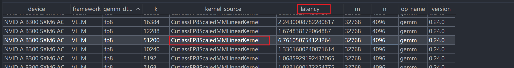

---
Here's the detailed lifecycle of gemm_perf.parquet:

  ———

  ## 何时被加载？

  懒加载，首次查询时触发。 具体链路：

  1. 用户调用 PerfDatabase.query_gemm(...) 或访问 database.supported_quant_mode["gemm"]
  2. 这触发 GEMM.load_data(database) （gemm.py:114）
  3. load_data 先检查类级缓存 _data_cache 是否已有此 (systems_root, system, backend, version, shared_layer) 的条目
  4. 缓存命中 → 直接跳过，不读文件
  5. 缓存未命中 → 调用 load_view(database, "_gemm_data", PerfDataFilename.gemm)，这才真正读取 parquet

  构造函数本身（1913–1979 行）不打开任何 parquet，只搭建懒加载基础设施。

  ———

  ## 如何被加载？

  加载分 Python 侧编排 和 Rust 侧实际 I/O 两层：

  ### Python 侧：路径解析 + 发起请求

  GEMM.load_data(db)
    └─ load_view(db, "_gemm_data", PerfDataFilename.gemm)     # engine_table_view.py:204
         ├─ resolve_op_data_path(system_data_root, "vllm", "0.24.0", "gemm_perf.parquet")
         │    # 扫描 system_data_root 下的 family 目录（如 "gemm"），
         │    # 拼出 <family>/vllm/0.24.0/gemm_perf.parquet，返回实际存在的路径
         └─ fetch_table_view(db, "_gemm_data")                  # engine_table_view.py:157
              ├─ _probe_spec_key(db) → 构建 probe-spec JSON（含 system/backend/version/源列表）
              ├─ _probe_handle_from_key() → 创建 Rust AicEngine 实例
              └─ handle._engine.table_view_json("_gemm_data")   # FFI 调用 Rust

  ### Rust 侧：实际读 parquet + 构建内存结构

  AicEngine.table_view_json("_gemm_data")
    └─ GemmTable.load_gemm()                                    # gemm.rs:427
         └─ load_gemm_parquet(&self.gemm_sources)               # gemm.rs:693
              for source in sources:                             # 按优先级遍历（shared-layer 兄弟行）
                PerfReader::open(path)                           # 用 arrow-rs 读 parquet
                逐行读取列: gemm_dtype, m, n, k, latency, power, kernel_source
                跳过 awq/gptq 不支持的 dtype
                by_quant[gemm_dtype][m][n][k] = LeafValue(latency, power)   # first-wins 去重
              clamp_gemm_grids_to_sol()                          # SOL 下限修正
              构建 GemmEngineGrids（Node + SiteIndex）            # 供插值查询用

  加载后数据通过 FFI 以 JSON 字符串返回 Python，Python 侧 _rehydrate 将字符串键还原为 enum/int 等类型，包装为 LoadedOpData 绑定到 db._gemm_data。

  ———

  ## 如何被使用？

  加载后的数据以 嵌套字典 形式存在：

  db._gemm_data[quant_mode][m][n][k] → {latency, power, energy}

  查询时 Rust 引擎在此网格上做 最近邻插值（nearest-k + site index），对未命中的 (m, n, k) 形状返回估算值。查询路径还会：

  - 对结果取 max(查询值, SOL) 作为下限（roofline 约束）
  - 在 HYBRID 模式下，可能结合公式计算值与实测值取最优
  - 查询结果被 Rust 侧的 LRU query_cache 缓存，相同 shape 不重复计算

  简言之：parquet 是原始实测网格点，加载后变成内存中的多维查找表，查询时在网格上插值估算任意 shape 的延迟/功耗。

---

parallel_config_list如何构建？

• 构建链路分三层：用户声明 → 默认值填充 → 笛卡尔积+约束过滤。

  ———

  ## 第一层：用户声明（TaskConfig 字段）

  用户在 TaskConfig 中声明每个维度的候选值，均为 list[int] | None：

  agg_tp_candidates: list[int] | None = None   # tensor parallel
  agg_pp_candidates: list[int] | None = None   # pipeline parallel
  agg_dp_candidates: list[int] | None = None   # data parallel
  agg_moe_tp_candidates: list[int] | None = None
  agg_moe_ep_candidates: list[int] | None = None
  agg_cp_candidates: list[int] | None = None   # context parallel
  agg_num_gpu_candidates: list[int] | None = None  # GPU 数量约束

  ———

  ## 第二层：默认值填充（_resolve_agg_search）

  None 的字段由 _resolve_agg_search() 自动补全（task_v2.py:1607），规则如下：

  非 MoE 模型 → 简单 TP/PP 搜索：

  - tp/num_gpu = [1, 2, 4, 8]（Blackwell 加到 16）
  - pp/dp/moe_tp/moe_ep = [1]

  MoE 模型 + SGLang MegaMoE → 专用 MegaMoE 配置表

  MoE 模型 + 其他后端 → "fused" 默认 + large-EP ladder：

  - fused 默认：tp/dp/moe_ep/num_gpu = [1, 2, 4, 8]（Blackwell 加到 16）
  - large-EP ladder（当 perf 数据覆盖大 EP shape 时）：如 trtllm 加入 [2,4,8,16,32,64] 的 dp/moe_ep
  - 两者取并集，确保搜索空间同时覆盖单节点和多节点配置

  ———

  ## 第三层：枚举 + 过滤（enumerate_parallel_config）

  iter_parallel("agg") 调用 enumerate_parallel_config()（utils.py:140），对候选列表做笛卡尔积并施加约束：

  for tp in tp_list:
      for pp in pp_list:
          for dp in dp_list:
              for moe_tp in moe_tp_list:
                  for moe_ep in moe_ep_list:
                      for cp in cp_list:
                          # 约束1: 总 GPU 数必须在 num_gpu_list 中
                          if dp * tp * pp * cp not in num_gpu_list: continue
                          # 约束2: MoE 宽度必须匹配
                          if dp * tp * cp != moe_tp * moe_ep: continue
                          # 约束3: 后端特有限制
                          #   trtllm: dp>1 时 tp 必须为 1
                          #   sglang+megamoe: moe_tp 必须为 1
                          #   vllm: moe_tp>1 和 moe_ep>1 不能同时
                          parallel_config_list.append([tp, pp, dp, moe_tp, moe_ep, cp])

  ———

  总结： 用户可以完全自定义，也可以留空让系统根据模型类型（MoE/非 MoE）、后端（trtllm/vllm/sglang）、硬件（是否 Blackwell）和 perf 数据覆盖自动推导出合理的搜索
  空间。最终输出是一组 [tp, pp, dp, moe_tp, moe_ep, cp] 六元组，每个都满足 GPU 数量约束和后端兼容性。

---

        mix_step_estimate = self.run_mixed(
            model,
            database,
            runtime_config,
            MixedStepInput(
                context_tokens=num_mix_ctx_tokens,
                num_decode_requests=num_mix_gen_tokens,
            ),
        )
算AGG混合阶段的时延

---

aic-core\src\aiconfigurator_core\sdk\engine.py:677-701  这三个代码的具体实现和计算过程在哪里？

这三个方法的实际计算都在 Rust 引擎中，核心在 aic-core/rust/aiconfigurator-core/src/engine/runtime.rs。

  ———

  ## 1. predict_prefill_latency (runtime.rs:529)

  pub fn predict_prefill_latency(&self, bs: u32, isl: u32, prefix: u32) -> Result<f64, AicError> {
      let rt = RuntimeConfig { batch_size: bs, isl, osl: 1, prefix, .. };
      self.run_static(&rt, StaticMode::Context, stride)?.total_ms
  }

  计算过程： 构造一个 RuntimeConfig，调用 run_static(mode=Context)，即执行一次完整的 context phase 遍历：对 context_ops 列表中的每个 op 逐个查询，effective_isl
  = isl - prefix，token 数 = batch_size * effective_isl（logits GEMM 除外用 batch_size），所有 op 的延迟求和。

  ———

  ## 2. predict_decode_latency (runtime.rs:546)

  pub fn predict_decode_latency(&self, bs: u32, isl: u32, osl: u32) -> Result<f64, AicError> {
      let rt = RuntimeConfig { batch_size: bs, isl, osl, .. };
      self.run_static(&rt, StaticMode::Generation, stride)?.total_ms
  }

  计算过程： 调用 run_static(mode=Generation)，执行一次 generation phase 遍历：batch 缩放为 bs * (nextn + 1)（speculative decoding），然后按 stride 在 decode
  轨迹上积分：

  for i in (0..osl-1).step_by(stride):
      s = isl + i + 1                          // KV 序列位置
      step = Σ generation_ops(batch=bs, s=s)   // 每个 op 查询
      generation += step * repeat_count        # repeat_count = min(stride, osl-1-i)

  ———

  ## 3. mixed_step_latency (runtime.rs:591)

  这是最复杂的一个，实现 chunked prefill + decode 的混合步延迟。内部调用 mixed_step_breakdown，分三遍（pass）计算：

  Pass 1 — 共享非注意力工作：

  decode_query_tokens = gen_tokens * (nextn + 1)   // speculative 模型
  combined = ctx_tokens + decode_query_tokens
  prefix1 = prefix * floor(ctx / isl)
  // 跳过 context_attention，遍历其余所有 context_ops
  shared_non_attention = run_context_ops(batch=1, effective_isl=combined-prefix1, prefix=prefix1)

  Pass 2 — Context Attention（在 prefill shape 上）：

  batch2 = ceil(ctx_tokens / isl)
  scale2 = ceil(isl / ctx_tokens)
  // 只查 context_attention op
  context_attention = run_context_ops(batch=batch2, effective_isl=isl-prefix, prefix=prefix) / scale2

  Pass 3 — Decode Attention（当 gen_tokens > 0）：

  bs = gen_tokens * (nextn + 1)
  s = isl + osl/2 + 1          // KV 位置
  // 只查 generation_attention op
  decode_attention = run_generation_ops_step(batch=bs, kv_seq=s)

  最终结果：

  total = shared_non_attention + context_attention + decode_attention

  ———

  底层 op 查询（session.rs）： 每个 run_context_ops / run_generation_ops_step 都是遍历 op 列表，对每个 op 构造 RuntimeContext（batch_size、kv_seq、token 数、
  imbalance scale 等），调用 op.query(db, &ctx)。这个 query 最终走到 Rust 侧的性能数据查询——在 parquet 加载后的内存网格上做插值，返回该 op 的延迟。

---

rust计算延迟操作的调用链：

  ———

  ## 完整调用链

  predict_prefill_latency / predict_decode_latency
  │
  └─ run_static(mode=Context/Generation)              [runtime.rs:402]
      │
      ├─ run_context_phase(runtime)                   [runtime.rs:427]
      │   │  有效 isl = isl - prefix
      │   └─ run_context_ops(ops, db, batch, effective_isl, prefix, scale, filter=All)  [session.rs:41]
      │       │
      │       └─ run_context_ops_with(...)            [session.rs:67]
      │           │  遍历 context_ops 列表，按 filter 跳过/保留
      │           └─ query_context_op(op, db, batch, effective_isl, prefix, scale)  [session.rs:106]
      │               │  构造 RuntimeContext:
      │               │    s = effective_isl
      │               │    num_tokens = batch * effective_isl  (logits GEMM 用 batch)
      │               └─ op.query(db, ctx)             [op.rs:407]
      │                   │  按 Op 枚举分发，例如:
      │                   │    Gemm(op)       → op.query(db, num_tokens, None)
      │                   │    ContextAttn(op)→ op.query(db, batch, s, prefix, scale)
      │                   │    Nccl(op)       → op.query(db, num_tokens)
      │                   │    ...
      │                   └─ 以 GemmOp.query 为例       [operators/gemm.rs:80]
      │                       │  m = x / scale_num_tokens, 按 CP 分片
      │                       └─ query_gemm_table(db, quant, m, n, k)  [operators/gemm.rs:191]
      │                           │  按 database_mode 分发:
      │                           │    SOL/SOL_FULL → 纯 roofline 计算
      │                           │    EMPIRICAL    → 公式估算
      │                           │    HYBRID       → 先查表，miss 走公式
      │                           │    SILICON      → 纯查表
      │                           └─ db.gemm.query(quant, m, n, k)   [perf_database/gemm.rs:229]
      │                               │  1. fp8_static → fp8 归一化
      │                               │  2. 解析 tc_flops (roofline 参数)
      │                               │  3. 查 LRU 缓存 (GemmQueryKey)
      │                               │  4. 缓存 miss → load_gemm() 触发 parquet 加载
      │                               │  5. SiteIndex.resolve_value(&cfg, [m, n, k])
      │                               │     → perf_interp::query_value  [perf_interp.rs:293]
      │                               │       精确命中 → 直接返回
      │                               │       未命中  → 最近邻插值 (ScatteredSites/Grid)
      │                               └─ 返回 LeafValue{latency, power, energy}
      │
      └─ run_generation_phase(runtime, stride)        [runtime.rs:460]
          │
          └─ run_generation_phase_with(runtime, stride, sink)  [runtime.rs:471]
              │  bs = batch_size * (nextn + 1)
              │  for i in (0..osl-1).step_by(stride):
              │      s = isl + i + 1
              │      repeat_count = min(stride, osl-1-i)
              └─ run_generation_ops_step_beamed_with(ops, db, bs, beam, s, scale)  [session.rs:194]
                  │  遍历 generation_ops 列表
                  └─ query_generation_op(op, db, bs, beam, s, scale)  [session.rs:233]
                      │  构造 RuntimeContext:
                      │    s = kv_seq_tokens
                      │    num_tokens = batch * beam
                      └─ op.query(db, ctx)             [op.rs:407]
                          │  按 Op 枚举分发，例如:
                          │    GenerationAttn(op) → op.query(db, batch, s, scale)
                          │    Gemm(op)           → op.query(db, num_tokens)
                          └─ (同上，最终走到 perf_interp 插值)

  ———

  ## 每层函数的意义

   层级              函数                                                          意义
  ━━━━━━━━━━━━━━━━  ━━━━━━━━━━━━━━━━━━━━━━━━━━━━━━━━━━━━━━━━━━━━━━━━━━━━━━━━━━━━  ━━━━━━━━━━━━━━━━━━━━━━━━━━━━━━━━━━━━━━━━━━━━━━━━━━━━━━━━━━━━━━━━━━━━━━━━━━━━━
   入口              predict_prefill_latency / predict_decode_latency              薄封装，构造 RuntimeConfig 后调 run_static
  ────────────────  ────────────────────────────────────────────────────────────  ─────────────────────────────────────────────────────────────────────────────
   调度              run_static                                                    按 StaticMode 分发到 context 和/或 generation phase
  ────────────────  ────────────────────────────────────────────────────────────  ─────────────────────────────────────────────────────────────────────────────
   Phase 遍历        run_context_phase / run_generation_phase_with                 计算有效参数（effective_isl、decode batch），遍历 op 列表，generation 还做
                                                                                   stride 积分
  ────────────────  ────────────────────────────────────────────────────────────  ─────────────────────────────────────────────────────────────────────────────
   Op 列表遍历       run_context_ops_with / run_generation_ops_step_beamed_with    遍历 ops，按 filter 筛选，逐个调用 query_context_op / query_generation_op
  ────────────────  ────────────────────────────────────────────────────────────  ─────────────────────────────────────────────────────────────────────────────
   单 Op 查询包装    query_context_op / query_generation_op                        构造 RuntimeContext（batch、s、token 数、scale），调 op.query
  ────────────────  ────────────────────────────────────────────────────────────  ─────────────────────────────────────────────────────────────────────────────
   Op 分发           Op::query (op.rs:407)                                         按枚举类型分发到具体 op 的 query 方法（GemmOp、ContextAttentionOp 等）
  ────────────────  ────────────────────────────────────────────────────────────  ─────────────────────────────────────────────────────────────────────────────
   具体 Op 计算      以 GemmOp::query 为例                                         计算 m/n/k，查 query_gemm_table，fp8_static 做 compute_scale 减法，SOL 下限
                                                                                   修正
  ────────────────  ────────────────────────────────────────────────────────────  ─────────────────────────────────────────────────────────────────────────────
   DB 模式分发       query_gemm_table                                              按 database_mode 决定：查表 / 公式估算 / 混合
  ────────────────  ────────────────────────────────────────────────────────────  ─────────────────────────────────────────────────────────────────────────────
   查表 + 缓存       GemmTable::query                                              fp8 归一化 → LRU 缓存 → 解析 tc_flops → SiteIndex.resolve_value
  ────────────────  ────────────────────────────────────────────────────────────  ─────────────────────────────────────────────────────────────────────────────
   插值              perf_interp::query_value                                      精确命中直接返回；未命中用最近邻（ScatteredSites）或多线性插值（Grid）估算

  核心数据流：parquet → 内存网格（Node） → SiteIndex → 插值查询 → LeafValue{latency, power, energy}，每一层 op 再根据自身语义（token 缩放、SOL 修正、fp8_static
  组合等）加工最终延迟。

---

其中的 CutlassFP8ScaledMMLinearKernel 来自于 vllm.model_executor.kernels.linear.scaled_mm.cutlass 中的 class CutlassFP8ScaledMMLinearKernel

https://docs.vllm.ai/en/latest/api/vllm/model_executor/kernels/linear/scaled_mm/cutlass/

---

 index.resolve_value(&cfg, &[m as f64, n as f64, k as f64])  具体查询*.parquet文件是如何进行的？

：

以 GEMM 查询 (m, n, k, quant) 为例，从 parquet 到最终结果分三个阶段：

  ———

  ## 阶段一：parquet → 内存数据结构（加载时，一次性）

  gemm_perf.parquet  (磁盘)
      │
      │  load_gemm_parquet()  [gemm.rs:693]
      │  PerfReader::open(path) 读 parquet，逐行:
      │    读列: gemm_dtype, m, n, k, latency, power
      │    by_quant[gemm_dtype][m][n][k] = LeafValue{latency, power, energy}
      │
      ▼
  Grid3<LeafValue>  (嵌套 BTreeMap: quant → m → n → k → leaf)
      │
      │  grid3_to_node()  [gemm.rs:605]
      │  遍历每个 (m, n, k) → node.insert_value([m, n, k], leaf)
      │
      ▼
  Node  (嵌套 BTreeMap: m → n → k → Leaf)
      │
      │  SiteIndex::build_with_site_order()  [perf_interp.rs:827]
      │  从 Node 中提取所有叶子，按 site_axes=[n,k] 分组:
      │    sites[(n,k)] = [(m, LeafValue), ...]  ← 一条 curve
      │  按 m 排序每条 curve，预计算 site_logs = log2(n), log2(k)
      │
      ▼
  SiteIndex {
      sites:      BTreeMap<[n,k] → [(m, LeafValue) 按 m 排序]>,
      site_logs:  Vec<([n,k], [log2(n), log2(k)])>,
      curve_bounds: Vec<(m_min, m_max)>,
  }

  GEMM 的配置是 site_axes=[n,k], curve_axis=m，意思是：每个 (n, k) 组合是一条 site，site 上沿 m 轴扫出一条 curve。

  ———

  ## 阶段二：查询 (m, n, k) 的解析过程

  index.resolve_value(cfg, [m, n, k])
      │
      ▼
  resolve_pair()  [perf_interp.rs:873]

  Step 1 — 精确命中检查：

  site_ints = [n as u32, k as u32]
  if sites.get([n, k]) 存在:
      curve = sites[(n,k)]   // 这条 site 的 m-axis curve
      调用 eval_curve(curve, m)  // 在 curve 上查 m

  Step 2 — eval_curve（在一条 curve 上插值） [perf_interp.rs:1093]：

  curve = [(m0, leaf0), (m1, leaf1), (m2, leaf2), ...]  已按 m 排序

  case A: m 精确命中某个 m_i → 直接返回 leaf_i.latency

  case B: m 在 curve 范围内但未命中 → 线性插值:
      找到 m_lo < m < m_hi
      w = (m - m_lo) / (m_hi - m_lo)
      latency = lat_lo + (lat_hi - lat_lo) * w

  case C: m 超出 curve 范围（below/above grid）→ util-hold:
      取边界的 k_tail=3 个点
      计算每个边界点的 utilization = SOL(m_i, n, k) / latency_i
      取 median(util) 作为该 site 的代表利用率
      latency = SOL(m, n, k) / median(util)

  Step 3 — 未精确命中 (n, k) site → 最近邻 IDW 转移：

  当查询的 (n, k) 不在已采集的 site 中时：

  q_log = [log2(n), log2(k)]

  1. 对所有已采集 site 计算 log-space 欧氏距离
     dist_i = sqrt((log2(n_i) - log2(n))^2 + (log2(k_i) - log2(k))^2)

  2. 过滤: dist <= max_site_distance (2.0)
     保留 require_curve_coverage 的 site (curve 覆盖 m 范围内)

  3. 取最近的 nn_sites=4 个 site

  4. 对每个邻居 site_i:
     - 调用 eval_curve(curve_i, m) → (lat_i, power_i)
     - 计算 site_i 的 SOL_i = SOL(m, n_i, k)
     - 计算 utilization_i = SOL_i / lat_i
     - 权重 w_i = 1 / (dist_i^2 + ε)

  5. IDW 加权:
     util_transfer = Σ(w_i * util_i) / Σ(w_i)
     power = Σ(w_i * power_i) / Σ(w_i)

  6. 最终:
     latency = SOL(m, n, k) / util_transfer
     energy = power * latency

  ———

  ## 阶段三：回到 GemmOp 做后处理

  返回 LeafValue{latency, power, energy}
      │
      ▼
  GemmOp::query  [operators/gemm.rs:80]
      │
      ├─ fp8_static: 减去 compute_scale / scale_matrix 开销
      ├─ SOL 下限修正: latency = max(latency, SOL(m,n,k))
      └─ 乘以 scale_factor → 最终 PerformanceResult

  ———

  总结一句话： parquet 的每一行 (m, n, k, latency, power) 被组织成 以 (n, k) 为 site、以 m 为 curve 轴 的散点索引；查询时先在精确 site 上沿 m 插值，site 未命中
  则用 log-space 最近邻 IDW 转移 utilization（SOL/measured），最终用查询点自己的 SOL 反算延迟。

---

延迟计算的核心部分如果迁移框架至910B是否变化？
：

核心计算逻辑不需要变。 整个框架的设计是数据驱动的，但有几层需要适配的工作：

  ———

  ## 不需要变的部分

   模块          原因
  ━━━━━━━━━━━━  ━━━━━━━━━━━━━━━━━━━━━━━━━━━━━━━━━━━━━━━━━━━━━━━━━━━━━━━━━━━━━━━━━━━━━━━━━━━━━━━━━━━━━━━━━━━━━━━━━━━━━━━━━━━━━
   SOL 公式      sol_math = 2·m·n·k / tc_flops · 1000，sol_mem = memory · (m·n+m·k+n·k) / mem_bw · 1000 — 纯数学，无硬件假设
  ────────────  ─────────────────────────────────────────────────────────────────────────────────────────────────────────────
   插值引擎      SiteIndex.resolve_value / eval_curve — 纯数值算法，不关心数据来自哪款 GPU
  ────────────  ─────────────────────────────────────────────────────────────────────────────────────────────────────────────
   三遍混合步    mixed_step_latency 的 pass1/2/3 拆分 — 描述的是计算模式（prefill/decode），不依赖硬件
  ────────────  ─────────────────────────────────────────────────────────────────────────────────────────────────────────────
   IDW 转移      log-space 最近邻 + utilization 转移 — 通用统计方法
  ────────────  ─────────────────────────────────────────────────────────────────────────────────────────────────────────────
   框架调度      run_static → run_context_ops → op.query — 纯调用链，与硬件无关

  ———

  ## 需要新增/适配的部分

  1. 系统 YAML（必须）

  新建 910b_sxm.yaml，填入 910B 的硬件参数：

  gpu:
    mem_bw: ...          # 910B HBM 带宽
    bfloat16_tc_flops: ...  # 910B 的 AICore bf16 算力
    int8_tc_flops: ...      # 910B 的 AICore int8 算力
    # fp8_tc_flops 不填即可，910B 不原生支持 fp8
    mem_capacity: ...
    power: ...
    sm_version: 0          # 非 NVIDIA，填 0 或自定义标识

  2. 性能数据 parquet（必须）

  在 data/910b_sxm/<op>/<backend>/<version>/ 下提供 910B 实测的 parquet 文件。这是最大的工作量——需要在 910B 上实际跑 benchmark 采集每个 op 的延迟。

  3. Quant 模式（可能需要扩展）

  当前 ComputeDtype 只有 bfloat16 / int8 / fp8 / fp4，且 flops_key 硬编码为 bfloat16_tc_flops 等 YAML 字段名。如果 910B 需要：

  - W8A8（int8 量化） → 可直接复用 Int8Wo / Sq，只需 YAML 填对应 int8_tc_flops
  - 自定义量化格式（如 910B 特有的量化方案）→ 需在 enums.rs 中扩展 GemmQuantMode 枚举并添加 QuantMapping

  4. 后端标识（需扩展）

  当前 BackendName 只有 trtllm / vllm / sglang。适配 910B 需新增后端枚举（如 mindie / cann），并在 enumerate_parallel_config 中添加 910B 后端的并行策略过滤规
  则。

  5. 通信库（需扩展）

  NCCL 相关的 op（NcclOp、P2POp、CustomAllReduceOp）目前只有 NCCL 性能数据。910B 用 HCCL，需要：

  - 采集 HCCL 的性能数据（parquet）
  - 可能需要新增 HcclOp 或复用 NcclOp 结构

  6. 内存计算（需验证）

  mem_capacity 减去模型权重、KV cache 等的计算逻辑是通用的，但 910B 的内存开销结构（框架占用、CANN 运行时等）可能需要调整 other_mem / nccl_mem 等 misc 字段。

  ———

  总结： 核心计算引擎（插值、SOL、三遍混合步）是纯数据驱动的，不需要改代码。适配 910B 的主要工作是 采集性能数据 + 编写系统 YAML + 可能的 枚举扩展（quant mode、
  backend、comm op）。框架的架构设计让这些扩展都落在数据层和枚举层，不触及计算核心。

